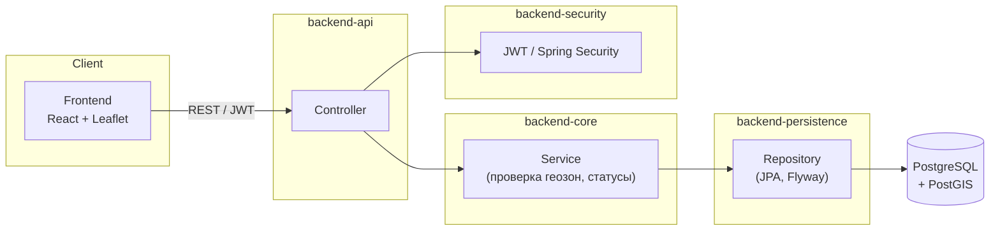

# BAS Verification

Веб-сервис подачи и согласования планов полётов беспилотных авиационных систем (БАС).

Автоматическая проверка маршрутов на соответствие геозонам (PostGIS). Спорные
заявки направляются на ручное рассмотрение администратору.

## Стек

- **Бэкенд:** Java 25, Spring Boot 4.x, Gradle (multi-module)
- **База данных:** PostgreSQL 16 + PostGIS 3.4
- **Фронтенд:** React 19, Vite 6, TypeScript 5.7, Leaflet
- **API-документация:** Springdoc OpenAPI (Swagger UI)
- **Тесты:** JUnit 5, Mockito, Testcontainers

## Структура проекта

```
backend/
├── backend-api/           # REST-контроллеры, DTO, точка входа
├── backend-core/           # Бизнес-логика, алгоритм автопроверки
├── backend-security/       # JWT, Spring Security
└── backend-persistence/    # JPA-сущности, PostGIS, Flyway-миграции

frontend/                   # React SPA
docker/                     # docker-compose (PostgreSQL + PostGIS)
```

## Архитектура



**Модель данных:** `User` (1) → `Route` (N) → `RoutePoint` (N); `User` (1) → `VerificationZone` (N).
Route хранит статус (`SUBMITTED` / `APPROVED` / `REJECTED`) и результат автопроверки.

**Автопроверка:** при создании маршрута его точки и линия между ними
проверяются на вхождение в каждую зону (граница считается «внутри»). Если
находится зона, полностью содержащая маршрут — статус `APPROVED`. Иначе —
`SUBMITTED`, маршрут уходит в очередь на ручное рассмотрение.

## Быстрый старт

```bash
# Поднять БД и бэкенд
docker compose -f docker/docker-compose.yml up -d

# Фронтенд (опционально, для локальной разработки)
cd frontend && npm install && npm run dev
```

Поднимаются два контейнера: `bas-postgres` (PostgreSQL + PostGIS, расширения
инициализируются через `init-db.sql`) и `bas-backend` — стартует после
healthcheck БД.

API-документация (Swagger): `http://localhost:8080/swagger-ui.html`

Переменные окружения бэкенда (заданы в `docker-compose.yml`):

| Переменная | Значение |
|------------|----------|
| `DB_HOST` | `db` |
| `DB_USER` | `bas_user` |
| `DB_PASSWORD` | `bas_pass` |
| `JWT_SECRET` | секрет для подписи JWT |

Первый администратор создаётся при старте приложения.

## Примеры запросов

### Регистрация / вход

```bash
curl -X POST http://localhost:8080/api/auth/register \
  -H "Content-Type: application/json" \
  -d '{"fullName": "Ivan Petrov", "email": "ivan@example.com", "password": "pass1234"}'

curl -X POST http://localhost:8080/api/auth/login \
  -H "Content-Type: application/json" \
  -d '{"email": "ivan@example.com", "password": "pass1234"}'
# -> { "token": "<jwt>", "role": "USER" }
```

### Маршруты

```bash
curl -X POST http://localhost:8080/api/routes \
  -H "Authorization: Bearer <token>" \
  -H "Content-Type: application/json" \
  -d '{
        "name": "Маршрут 1",
        "points": [
          {"lat": 55.751244, "lng": 37.618423},
          {"lat": 55.755, "lng": 37.62}
        ]
      }'
```

### Зоны и ручное рассмотрение (ADMIN)

```bash
curl -X POST http://localhost:8080/api/zones \
  -H "Authorization: Bearer <admin_token>" \
  -H "Content-Type: application/json" \
  -d '{
        "name": "Зона 1",
        "coordinates": [
          {"lat": 55.74, "lng": 37.60},
          {"lat": 55.74, "lng": 37.65},
          {"lat": 55.77, "lng": 37.65},
          {"lat": 55.77, "lng": 37.60},
          {"lat": 55.74, "lng": 37.60}
        ]
      }'

curl -X GET http://localhost:8080/api/admin/routes/pending \
  -H "Authorization: Bearer <admin_token>"

curl -X POST http://localhost:8080/api/admin/routes/{id}/approve \
  -H "Authorization: Bearer <admin_token>"

curl -X POST http://localhost:8080/api/admin/routes/{id}/reject \
  -H "Authorization: Bearer <admin_token>"
```

Полная спецификация — в Swagger UI.

## Тесты

```bash
./gradlew test      # модульные (алгоритм автопроверки, конечный автомат статусов)
./gradlew integrationTest  # интеграционные (Testcontainers, REST → БД)
```

## Роли

| Роль  | Доступ |
|-------|--------|
| USER  | создание и просмотр своих маршрутов |
| ADMIN | создание зон, рассмотрение заявок |

Авторизация — JWT Access Token, TTL 24 часа, без refresh-токенов.